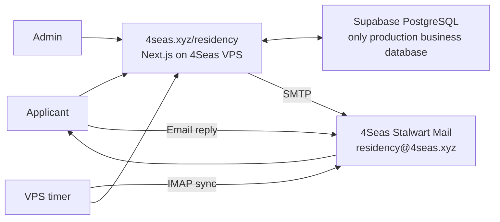

# Production architecture

## Runtime

- The application runs on the 4Seas VPS.
- The public base path is `/residency`.
- Supabase PostgreSQL is the only production business database.
- The VPS-local PostgreSQL copy is retained for recovery only and receives no production writes.

## Data

- `applications`: submitted applications and review status.
- `review_notes`: internal reviewer notes.
- `email_log`: outbound email attempts and provider message identifiers.
- `inbound_emails`: applicant replies imported from the mailbox.
- Incoming replies are matched by `In-Reply-To`/`References`; sender matching is a fallback.
- Ambiguous messages remain unmatched and are never attached to an application automatically.

## Email

- Outbound email uses authenticated SMTP through the 4Seas Stalwart server.
- The sender and reply mailbox is `residency@4seas.xyz`.
- Inbound replies are read over IMAP by a VPS timer.
- The admin application displays matched replies in the related application record.

## Operations

- Database migrations live in `supabase/migrations/`.
- Production secrets live only in the VPS environment file.
- Releases are immutable directories; the active release is selected by a symlink.
- Before a database or release cutover, create a validated backup and retain the previous release for rollback.

## Public-repository safety

- Never commit passwords, connection strings, API keys, session secrets, mailbox credentials, IP addresses, backups, applicant data, or production environment files.
- `.env.example` contains names and non-secret examples only.
