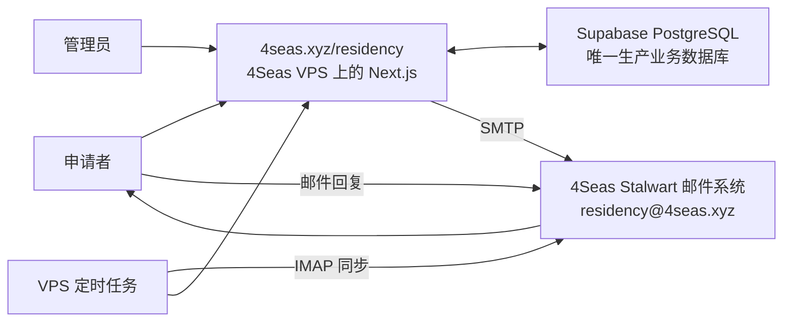

# 4Seas Residency

清迈 4Seas 驻留项目（加密 / 艺术 / 长寿）的营销网站、申请漏斗和管理员审核面板。

产品规格：[docs/PRD.md](./docs/PRD.md) · 技术设计：[docs/TECH-DESIGN.md](./docs/TECH-DESIGN.md) · 维护与部署：[docs/MAINTENANCE-AND-DEPLOYMENT.md](./docs/MAINTENANCE-AND-DEPLOYMENT.md)

## 技术栈

Next.js 16 (App Router) · React 19 · TypeScript · Tailwind v4 · Supabase PostgreSQL · Stalwart SMTP/IMAP · 4Seas VPS

**架构一言以蔽之：** 浏览器绝不直接接触数据库或邮箱；VPS 应用直接与 Supabase PostgreSQL 和 4Seas 邮件服务器通信。

## 生产架构

详细版本：[ARCHITECTURE.md](./ARCHITECTURE.md)。

## 运行与数据

- 应用运行在 4Seas VPS，对外路径为 `/residency`。
- Supabase PostgreSQL 是唯一生产业务数据库；VPS 本地 PostgreSQL 仅保留作恢复用途，不接收生产写入。
- `applications` 保存申请与审核状态，`review_notes` 保存内部审核记录。
- `email_log` 保存发件记录和邮件标识，`inbound_emails` 保存从邮箱同步的申请者回复。

## 邮件与后台

- 后台通过 4Seas Stalwart 的 SMTP，以 `residency@4seas.xyz` 发送邮件。
- VPS 定时任务通过 IMAP 同步申请者回复，并显示在对应的后台申请记录中。
- 回复优先通过 `In-Reply-To` / `References` 匹配，发件人仅作为后备；无法明确归属的邮件保持未匹配，不自动关联申请。

## 维护与安全

- 数据库迁移位于 `supabase/migrations/`；发布采用不可变目录，并通过符号链接切换当前版本。
- 数据库或版本切换前必须创建并验证备份，同时保留上一版本以便回滚。
- 生产凭据只保存在 VPS 环境文件中。公开仓库不得提交密码、连接字符串、API Key、会话密钥、邮箱凭据、服务器地址、备份、申请者数据或生产环境文件。
- `.env.example` 只包含变量名和非敏感示例。
