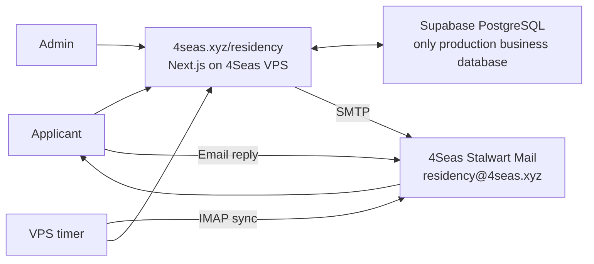

# 4Seas Residency



## Runtime

- The application runs on the 4Seas VPS at `/residency`.
- Supabase PostgreSQL is the only production business database.
- VPS-local PostgreSQL is retained for recovery only and receives no production writes.

## Data

- `applications`: applications and review status.
- `review_notes`: internal reviewer notes.
- `email_log`: outbound email attempts and provider message identifiers.
- `inbound_emails`: applicant replies imported from the mailbox.
- Replies are matched by `In-Reply-To`/`References`; sender matching is a fallback.
- Ambiguous messages remain unmatched and are never attached automatically.

## Email

- Outbound email uses authenticated SMTP through 4Seas Stalwart.
- The sender and reply mailbox is `residency@4seas.xyz`.
- A VPS timer imports replies over IMAP every five minutes.
- Matched replies appear in the related application record in Admin.

## Development

```bash
pnpm install
pnpm typecheck
pnpm build
```

- Run `supabase/migrations/` in numeric order.
- Copy `.env.example` to a private environment file and provide the required values.
- Production secrets live only on the VPS.

## Repository safety

- Never commit passwords, connection strings, API keys, session secrets, mailbox credentials, server addresses, backups, applicant data, or production environment files.
- `.env.example` contains variable names and non-secret examples only.
